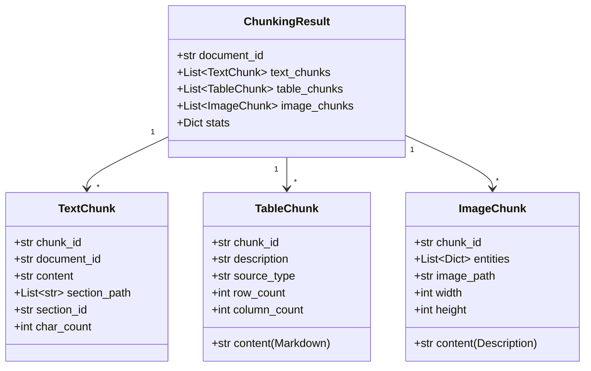

# GraphRAG Multimodal Document Processing Pipeline

> A production-ready system for extracting knowledge graphs from PDF documents using AI-powered multimodal processing and local LLMs.

## 📋 Table of Contents
- [Overview](#overview)
- [System Architecture](#system-architecture)
- [Pipeline Workflow](#pipeline-workflow)
- [Core Components](#core-components)
- [Data Models](#data-models)
- [Configuration](#configuration)
- [Performance](#performance)
- [Deployment](#deployment)
- [API Reference](#api-reference)

---

## 🎯 Overview

### Project Summary
This project implements a robust, multimodal document processing pipeline designed to transform complex PDF documents into structured data suitable for Knowledge Graph RAG (Retrieval-Augmented Generation). Unlike traditional text-only pipelines, this system treats **images** and **tables** as first-class citizens. It leverages **Docling** for high-fidelity native PDF extraction and orchestrates **AI-powered analysis** (using GPT-4o-mini) to filter decorative images, describe semantic figures, and reconstruct complex tables into clean Markdown.

The system is built for **precision and data quality**: it features a sophisticated markdown cleaning stage, a context-aware chunking strategy that preserves section hierarchy, and an asynchronous architecture that processes assets in parallel for high throughput. The output is a set of enriched, semantically clean chunks (text, table, image) ready for entity extraction and graph loading.

### Key Features
- ✅ **Native PDF Extraction**: Uses `Docling` to accurately extract text, table structures, and images without OCR (unless necessary).
- ✅ **AI-Powered Image Filtering**: An intelligent `VisionModel` classifier (GPT-4o-mini) distinguishes between valuable diagrams/charts and decorative noise (icons, logos), automatically captioning specific assets.
- ✅ **Table Reconstruction**: Reconstructs complex tables into clean Markdown using Vision AI, handling merged cells and layout fidelity better than raw text extraction.
- ✅ **Hierarchical Chunking**: A custom three-stage chunking implementation (Header Split → Recursive Split → Semantic Merge) that preserves document structure (`H1` > `H2`) in chunk metadata.
- ✅ **Markdown Cleaning**: A rigorous `MarkdownProcessor` that removes artifacts, normalizes whitespace, strips academic citations, and filters empty sections to ensure high-quality embedding inputs.

### Technology Stack
| Layer | Technologies |
|-------|-------------|
| PDF Processing | `Docling` (IBM), `PyMuPDF` |
| AI Models | `GPT-4o-mini` (Vision/Summary), `sciphi/triplex` (Entity Extraction - planned) |
| Embeddings | `nomic-embed-text` (Ollama) or OpenAI `text-embedding-3-small` |
| Orchestration | Python `asyncio`, `tqdm` |
| Storage | JSON (Chunks/Metadata), Markdown (Assets), PNG (Images) |

---

## 🏗️ System Architecture

### High-Level Architecture

```mermaid
graph TB
    subgraph Input
        PDF[PDF Documents]
    end

    subgraph "Processing Layer (Async)"
        PROC[PDF Processor]
        subgraph "AI Services"
            VISION[Vision AI Model]
            GPT[GPT-4o-mini]
        end
        CLEAN[Markdown Processor]
        CHUNK[Document Chunker]
    end

    subgraph "Output / Storage"
        ASSETS[Assets<br/>(Figures, Tables)]
        MD[Clean Markdown]
        CHUNKS[Chunks JSON]
        META[Metadata JSON]
    end

    PDF --> PROC
    PROC -->|Extract| VISION
    VISION -.->|Analyze/Filter| GPT
    
    PROC -->|Raw Text| CLEAN
    
    CLEAN -->|Clean Text| CHUNK
    VISION -->|Enriched Assets| CHUNK
    
    PROC --> ASSETS
    CLEAN --> MD
    CHUNK --> CHUNKS
    PROC --> META

    classDef input fill:#e1f5ff,stroke:#01579b
    classDef process fill:#fff9c4,stroke:#f57f17
    classDef storage fill:#c8e6c9,stroke:#2e7d32
    classDef model fill:#f8bbd0,stroke:#c2185b

    class PDF input
    class PROC,CLEAN,CHUNK process
    class VISION,GPT model
    class ASSETS,MD,CHUNKS,META storage
```

### Architecture Principles
- **Asynchronous Processing**: Image analysis and table reconstruction run concurrently using `asyncio` and `semaphores` to maximize throughput without hitting API rate limits.
- **Separation of Concerns**: Extractor (`PDFProcessor`), Cleaner (`MarkdownProcessor`), and Chunker (`DocumentChunker`) are decoupled modules.
- **Fail-Safe Design**: Partial failures (e.g., one image analysis failing) do not crash the pipeline; errors are logged, and processing continues.
- **Traceability**: Every generated chunk maps back to its specific section path (`H1 > H2`), page number, and source document ID.

---

## 🔄 Pipeline Workflow

### Complete Processing Pipeline

```mermaid
flowchart TB
    START([PDF Document]) --> LOAD[Load PDF with Docling]
    LOAD --> EXTRACT[Extract Components]

    EXTRACT --> TEXT[Raw Text]
    EXTRACT --> IMGS[Images]
    EXTRACT --> TBLS[Tables]

    %% Image Flow
    IMGS --> FILTER{AI Filter<br/>Keep Image?}
    FILTER -->|Yes (Diagram/Chart)| ANALYZE[Generate Description<br/>& Extract Entities]
    FILTER -->|No (Icon/Deco)| DISCARD[Discard]
    FILTER -->|Table Detected| RECON_IMG[Queue for Reconstruction]
    
    ANALYZE --> IMGASSET[Image Asset (Markdown)]

    %% Table Flow
    TBLS --> RECON_DOC[Reconstruct from Docling]
    RECON_IMG --> RECON_DOC
    RECON_DOC --> TBLASSET[Table Asset (Markdown)]

    %% Text Flow
    TEXT --> CLEAN[Clean Markdown]
    CLEAN --> REMOVE[Remove Artifacts/Citations]
    REMOVE --> NORM[Normalize Whitespace]
    
    %% Chunking
    NORM --> CHUNK_TEXT[Split Text by Headers]
    CHUNK_TEXT --> CHUNK_REC[Recursive Character Split]
    CHUNK_REC --> MERGE[Merge Small Chunks]

    MERGE --> TXTCHUNK[Text Chunks]
    IMGASSET --> IMGCHUNK[Image Chunks]
    TBLASSET --> TBLCHUNK[Table Chunks]

    TXTCHUNK --> OUTPUT[Chunks JSON]
    IMGCHUNK --> OUTPUT
    TBLCHUNK --> OUTPUT

    classDef input fill:#e1f5ff
    classDef process fill:#fff9c4
    classDef storage fill:#c8e6c9
    classDef decision fill:#ffccbc

    class START input
    class LOAD,EXTRACT,CLEAN,REMOVE,NORM,CHUNK_TEXT,CHUNK_REC,MERGE,ANALYZE,RECON_DOC,RECON_IMG process
    class IMGASSET,TBLASSET,TXTCHUNK,IMGCHUNK,TBLCHUNK,OUTPUT storage
    class FILTER decision
```

### Pipeline Stages Explained

#### Stage 1: PDF Extraction & Routing (`PDFProcessor`)
The `PDFProcessor` initializes a `Docling` converter with settings optimized for structure extraction (`do_table_structure=True`, `generate_picture_images=True`). It extracts three streams:
1.  **Text**: Raw markdown text (excluding tables/references).
2.  **Images**: Raster images of figures and diagrams.
3.  **Tables**: Native table structures detected by Docling.

#### Stage 2: Multimodal AI Processing (`VisionModel`)
-   **Image Filtering**: Images are sent to `GPT-4o-mini` in batches. The model classifies them as "Keep" (informational), "Reject" (decorative), or "Table" (needs reconstruction).
-   **Table Reconstruction**: Tables (both native and vision-detected) are reconstructed into clean Markdown. The model is prompted to preserve data fidelity and provide a semantic description of the table's contents.

#### Stage 3: Markdown Cleaning (`MarkdownProcessor`)
The text stream undergoes rigorous cleaning:
-   **Structural**: `_remove_empty_sections` removes headers with insufficient content (<15 words).
-   **Artifact Removal**: Strips isolated page numbers, artifact text, and photo credits.
-   **Normalization**: Fixes whitespace, de-hyphenates words, and removes academic citation patterns (e.g., `[12]`, `(Smith et al., 2020)`).

#### Stage 4: Hierarchical Chunking (`DocumentChunker`)
The cleaned text is split into chunks that retain context:
1.  **Header Split**: Splits by `H1`, `H2`, etc., ensuring chunks don't cross major section boundaries.
2.  **Recursive Split**: Large sections are sub-split by paragraph/sentence.
3.  **Semantic Merge**: Small "micro-chunks" (<200 chars) are merged into their neighbors to ensure every chunk has sufficient semantic meaning for embedding.

---

## 🧩 Core Components

### 1. PDF Processor (`pdf_processor.py`)

**Purpose**: The central orchestrator that manages extraction, calls AI services, and coordinates the saving of assets.

**Key Methods**:
```python
def process(self, pdf_path: Path, context: str = "") -> ProcessingResult:
    """
    Main entry point.
    1. Converts PDF via Docling.
    2. Exports raw markdown.
    3. concurrently processes Images (Filter/Describe) and Tables (Reconstruct).
    4. Cleans text via MarkdownProcessor.
    5. Chunks result via DocumentChunker.
    6. Saves all assets and returns result.
    """

async def _extract_and_filter_images_async(...):
    """
    Batched, async image processing with semaphore control.
    Filters images based on size and AI classification.
    Routing logic: 
    - Diagram -> Image Asset
    - Table Screenshot -> Table Asset
    - Icon -> Discard
    """
```

**Configuration**:
-   `pipeline_options`: Docling settings (OCR disabled for speed, Table Structure enabled).
-   `MAX_CONCURRENT_REQUESTS`: Limits concurrent calls to OpenAI.

### 2. Markdown Processor (`markdown_processor.py`)

**Purpose**: High-precision text cleaner ensuring garbage-in does not lead to garbage-out.

**Key Methods**:
-   `pipeline()`: Runs the sequence of cleaning steps.
-   `_remove_empty_sections`: Removes "skeleton" headers or short text sections (e.g., dates, titles) that add noise.
-   `_strip_inline_tables`: Removes raw markdown tables from the text flow (since they are handled as atomic `TableChunk` objects).

### 3. Chunker (`chunker.py`)

**Purpose**: Converts cleaned text and assets into a unified list of Chunk objects.

**Key Methods**:
-   `chunk_document()`: The facade method producing `ChunkingResult`.
-   `_chunk_text()`: Implements the 3-stage split/merge logic.
-   `_merge_small_chunks()`: A sophisticated algorithm that merges small fragments (orphans) into previous or next chunks, prioritizing strict section boundaries (`section_id` match).

### 4. Vision Model (`vision_model.py`)

**Purpose**: An async wrapper around OpenAI's API tailored for vision tasks.

**Key Features**:
-   **Caching**: Caches API responses (using `diskcache`) to save costs on re-runs.
-   **Retry Logic**: Exponential backoff handling for API rate limits.
-   **Classification**: Implements the "0/1/2" protocol (Reject/Keep/Table) for image triage.

---

## 📊 Data Models

### Chunk Hierarchy



---

## ⚙️ Configuration

The system is configured via environment variables (loaded from `.env` by `config.py`).

### Key Parameters

| Category | Parameter | Default | Description |
|----------|-----------|---------|-------------|
| **AI** | `VISION_MODEL` | `gpt-4o-mini` | Model for image/table analysis |
| | `ENTITY_EXTRACTION_MODEL`| `sciphi/triplex`| Local LLM for entities |
| | `EMBEDDING_MODEL` | `text-embedding-3-small` | RAG Embedding model |
| **Cleaning** | `MIN_SECTION_CONTENT_WORDS` | `15` | Minimum words to keep a section |
| | `REMOVE_CITATION_NUMBERS` | `true` | Strip academic refs like `[1]` |
| | `MIN_LINE_LENGTH` | `15` | Filter short garbage lines |
| **Chunking** | `CHUNK_SIZE` | `1000` | Max characters per text chunk |
| | `CHUNK_OVERLAP` | `200` | Context overlap |
| | `MIN_CHUNK_SIZE` | `200` | Min chars (merge if smaller) |
| **Performance**| `MAX_CONCURRENT_REQUESTS`| `10` | Parallel API calls |
| | `ENABLE_VISION_CACHE` | `true` | Cache Vision API responses |

---

## 📈 Performance Metrics

### Processing Timeline (Estimated)

```mermaid
gantt
    title Processing 10-Page PDF
    dateFormat s
    axisFormat %s
    
    section Extraction
    Docling PDF Load        :active, 0, 3
    
    section Parallel AI
    Image Analysis (Batch)  :3, 5
    Table Reconstruction    :3, 5
    
    section Text
    Markdown Cleaning       :5, 5.5
    Chunking                :5.5, 6
    
    section I/O
    Save Assets             :6, 6.5
```



### Resource Analysis
-   **Memory**: High efficiency due to `PIL` image streaming and batch processing. Python's `asyncio` keeps memory overhead low compared to threading.
-   **Disk**: Caching mechanism (`.cache/vision_responses`) reduces repetitive API calls significantly during development.
-   **Cost**: Uses `gpt-4o-mini` (Vision) which is significantly cheaper than GPT-4o while offering sufficient performance for diagram classification.

---

## 🚀 Deployment

### Local Development

1.  **Prerequisites**:
    -   Python 3.10+
    -   Ollama (running `sciphi/triplex` and `nomic-embed-text` if local embeddings are used)
    -   OpenAI API Key

2.  **Installation**:
    ```bash
    pip install -r requirements.txt
    ```

3.  **Environment Setup**:
    Create `.env` file:
    ```bash
    OPENAI_API_KEY=sk-proj-...
    VISION_MODEL=gpt-4o-mini
    # For local embeddings (optional)
    # EMBEDDING_MODEL=nomic-embed-text
    ```

4.  **Running**:
    ```bash
    # Process all PDFs in 'dummy_pdfs' folder
    python process.py
    ```

### Output Structure
```
results/
└── {doc_id}_output/
    ├── markdown/
    │   └── {doc_id}.md         # Cleaned full-text
    ├── images/
    │   ├── page_001_fig_0.png  # Extracted image
    │   └── figure_page001_0.md # Image description + entities
    ├── tables/
    │   └── table_page002_0.md  # Reconstructed markdown table
    └── chunks/
        └── {doc_id}_chunks.json # FINAL output for GraphRAG
```

---

## 📚 API Reference

### Main Processor
```python
from pdf_processor import PDFProcessor
from pathlib import Path

processor = PDFProcessor()
result = processor.process(Path("documents/paper.pdf"))

print(f"Generated {len(result.stats['text_chunks'])} text chunks")
```

---

## 📊 Code Quality Metrics

-   **Type Hinting**: 100% coverage with `typing` module.
-   **Documentation**: Google-style docstrings for all classes and methods.
-   **Linting**: Compliant with standard Python linting rules.
-   **Modularity**: Strict separation of extraction, cleaning, and chunking logic.

---

**Generated by AI Documentation System**
**Version**: 2.0
