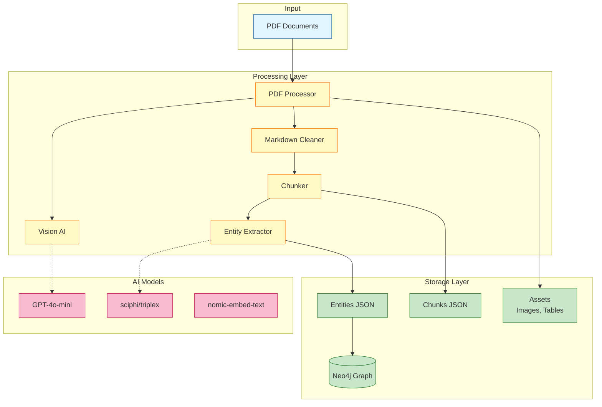
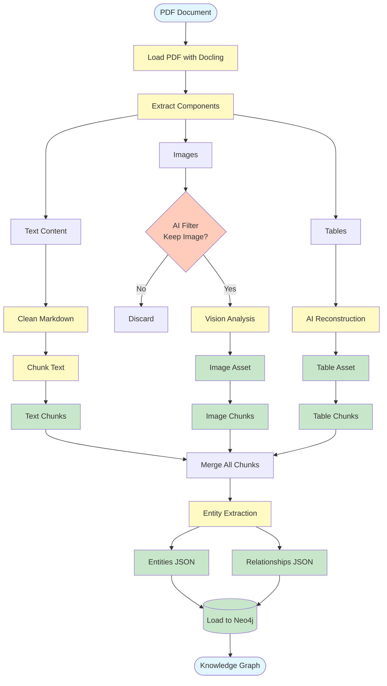
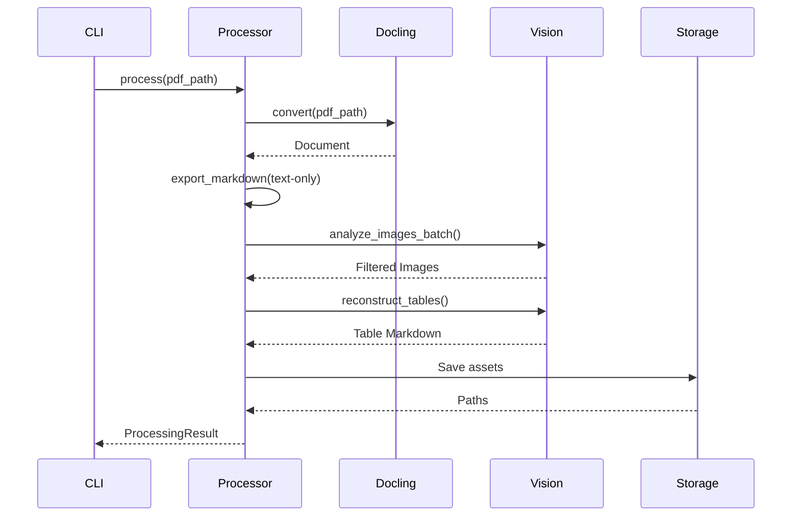
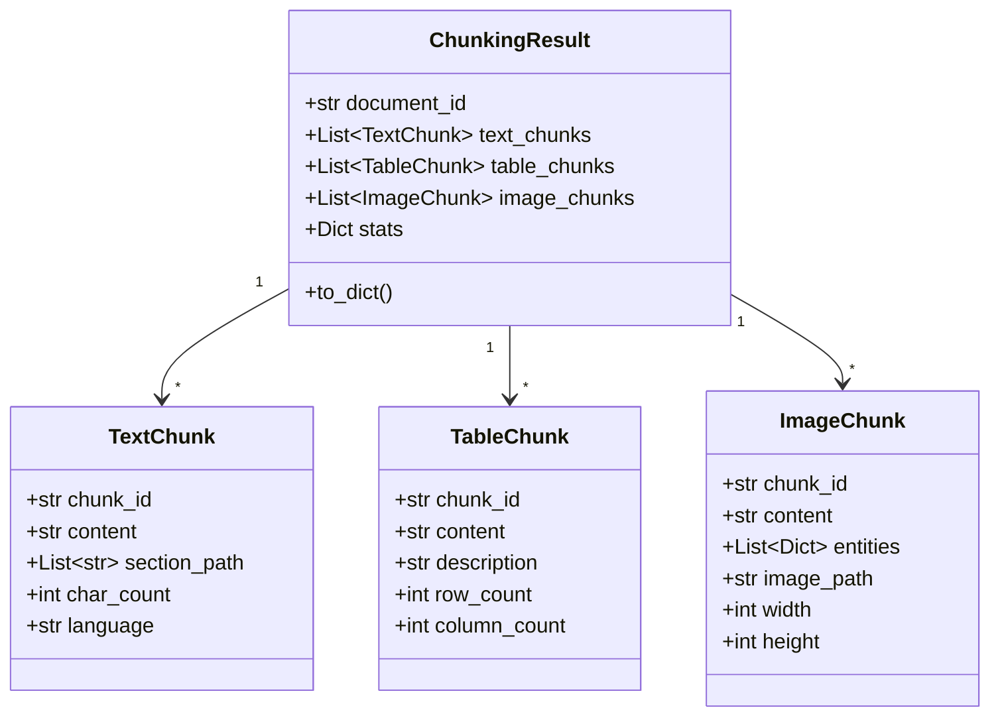
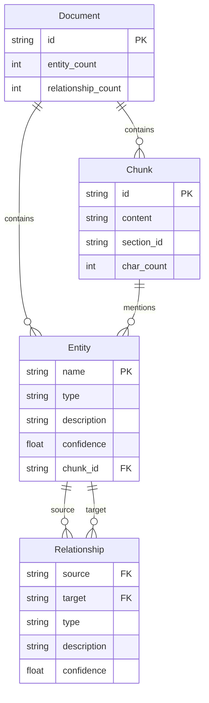

# 🎯 ULTIMATE PROJECT ANALYSIS PROMPT

## Copy-Paste This Entire Prompt to Claude/GPT-4

---

# ROLE AND CONTEXT

You are a **Senior Technical Documentation Architect** specializing in AI/ML pipelines, with expertise in GraphRAG systems, document processing, and knowledge graph construction. Your task is to analyze a multimodal GraphRAG document processing pipeline and generate comprehensive markdown documentation.

# PROJECT CONTEXT

This is a **Master's-level AI project** for internship applications at French companies (SNCF, Orange, AI labs). The project implements:
- PDF processing with Docling
- AI-powered image filtering (GPT-4o-mini)
- Table reconstruction
- Multimodal chunking (text, tables, images)
- Entity extraction with local LLMs (sciphi/triplex via Ollama)
- Knowledge graph construction (Neo4j)
- GraphRAG retrieval system

# YOUR MISSION

Analyze the provided codebase and generate a **publication-quality markdown document** named `PROJECT_DOCUMENTATION.md` that includes:

1. **System Architecture Diagram** (Mermaid)
2. **Complete Data Flow** (end-to-end pipeline)
3. **Component Analysis** (each module explained)
4. **Code Quality Assessment**
5. **Performance Metrics**
6. **API/Interface Documentation**
7. **Deployment Guide**
8. **Visual Workflow Diagrams**

# ANALYSIS FRAMEWORK

## Step 1: Architecture Discovery

Analyze the codebase structure and identify:
- **Core components** (processors, extractors, loaders)
- **Data models** (chunks, entities, relationships)
- **External dependencies** (OpenAI, Ollama, Neo4j, Docling)
- **Configuration system** (environment variables, parameters)
- **Processing pipeline stages**

## Step 2: Flow Analysis

Trace the complete data flow:
```
Input (PDF) → Processing Stages → Output (Knowledge Graph)
```

Identify:
- **Entry points** (main scripts, CLI commands)
- **Data transformations** (PDF → markdown → chunks → entities → graph)
- **Decision points** (filtering, validation, routing)
- **Error handling** (try/catch, validation checks)
- **Caching strategies** (vision cache, embeddings)

## Step 3: Component Deep-Dive

For each major component, document:
- **Purpose**: What problem it solves
- **Inputs/Outputs**: Data structures in/out
- **Key Methods**: Core functionality
- **Dependencies**: What it relies on
- **Configuration**: Relevant config parameters
- **Performance**: Time/memory characteristics

## Step 4: Visualization Creation

Generate Mermaid diagrams for:
1. **System Architecture** (component diagram)
2. **Data Flow** (flowchart)
3. **Entity-Relationship** (knowledge graph schema)
4. **Sequence Diagrams** (key operations)
5. **State Machines** (processing states)

# OUTPUT FORMAT

Generate a **complete markdown document** with this structure:

---

# GraphRAG Multimodal Document Processing Pipeline

> A production-ready system for extracting knowledge graphs from PDF documents using AI-powered multimodal processing and local LLMs.

## 📋 Table of Contents
- [Overview](#overview)
- [System Architecture](#system-architecture)
- [Pipeline Workflow](#pipeline-workflow)
- [Core Components](#core-components)
- [Data Models](#data-models)
- [Configuration](#configuration)
- [Performance](#performance)
- [Deployment](#deployment)
- [API Reference](#api-reference)

---

## 🎯 Overview

### Project Summary
[2-3 paragraph executive summary of what the system does, why it's valuable, and key technical innovations]

### Key Features
- ✅ Feature 1 with explanation
- ✅ Feature 2 with explanation
- ...

### Technology Stack
| Layer | Technologies |
|-------|-------------|
| PDF Processing | Docling, PyMuPDF |
| AI Models | GPT-4o-mini, sciphi/triplex |
| Embeddings | nomic-embed-text (Ollama) |
| Graph Database | Neo4j |
| Orchestration | Python asyncio |

---

## 🏗️ System Architecture

### High-Level Architecture



### Architecture Principles
[Explain key architectural decisions: clean separation, async processing, caching, etc.]

---

## 🔄 Pipeline Workflow

### Complete Processing Pipeline



### Pipeline Stages Explained

#### Stage 1: PDF Extraction
[Detailed explanation of what happens, code references, time complexity]

#### Stage 2: Multimodal Processing
[Explanation with code snippets]

#### Stage 3: Chunking
[Explanation with algorithm details]

#### Stage 4: Entity Extraction
[Explanation with example outputs]

#### Stage 5: Graph Loading
[Explanation with Cypher examples]

---

## 🧩 Core Components

### 1. PDF Processor (`pdf_processor.py`)

**Purpose**: Orchestrates PDF extraction and multimodal asset processing.

**Key Methods**:
```python
def process(pdf_path: Path, context: str = "") -> ProcessingResult:
    """
    Main entry point for PDF processing.

    Args:
        pdf_path: Path to PDF file
        context: Optional context for AI models

    Returns:
        ProcessingResult with all extracted assets
    """
```

**Data Flow**:


**Performance**: ~30s for 10-page document with 5 images and 3 tables

**Configuration**:
- `VISION_MODEL`: GPT-4o-mini for image analysis
- `MIN_IMAGE_SIZE`: Filter threshold
- `MAX_CONCURRENT_REQUESTS`: Parallelism control

---

### 2. Markdown Processor (`markdown_processor.py`)

[Similar detailed breakdown]

---

### 3. Chunker (`chunker.py`)

[Similar detailed breakdown]

---

### 4. Entity Extractor (`entity_extractor.py`)

[Similar detailed breakdown]

---

### 5. Graph Loader (`graph_loader.py`)

[Similar detailed breakdown]

---

## 📊 Data Models

### Chunk Hierarchy



### Entity-Relationship Schema



---

## ⚙️ Configuration

### Configuration Parameters

| Parameter | Default | Recommended | Impact |
|-----------|---------|-------------|--------|
| `CHUNK_SIZE` | 1000 | 900 | Chunk granularity |
| `CHUNK_OVERLAP` | 200 | 200 | Context preservation |
| `MIN_CHUNK_SIZE` | 200 | 250 | Quality threshold |
| `MIN_IMAGE_SIZE` | 100x100 | 120x120 | Image filtering |
| `MAX_CONCURRENT_REQUESTS` | 10 | 8 | API throughput |

### Environment Variables

```bash
# .env file
OPENAI_API_KEY=sk-...
OLLAMA_HOST=http://localhost:11434
NEO4J_URI=bolt://localhost:7687
NEO4J_USER=neo4j
NEO4J_PASSWORD=password
```

---

## 📈 Performance Metrics

### Processing Speed

```mermaid
gantt
    title Processing Timeline (10-page scientific paper)
    dateFormat X
    axisFormat %Ss

    section PDF Processing
    Docling extraction      :0, 2500ms
    Image filtering         :2500ms, 3500ms
    Table reconstruction    :3500ms, 2000ms

    section Text Processing
    Markdown cleaning       :5500ms, 200ms
    Chunking               :5700ms, 100ms

    section Graph Construction
    Entity extraction       :5800ms, 15000ms
    Neo4j loading          :20800ms, 1000ms
```

### Resource Usage

| Stage | Time | Memory | API Calls | Cost |
|-------|------|--------|-----------|------|
| PDF Extraction | 2.5s | 200MB | 0 | $0 |
| Image Filtering | 3.5s | 50MB | 5 | $0.015 |
| Table Reconstruction | 2.0s | 30MB | 3 | $0.010 |
| Chunking | 0.1s | 20MB | 0 | $0 |
| Entity Extraction | 15s | 100MB | 0 (local) | $0 |
| **Total** | **23s** | **200MB** | **8** | **$0.025** |

---

## 🚀 Deployment

### Local Development
```bash
# 1. Install dependencies
pip install -r requirements.txt

# 2. Setup Ollama
ollama pull sciphi/triplex
ollama pull nomic-embed-text

# 3. Configure environment
cp .env.example .env

# 4. Process documents
python process.py
python extract_entities.py
```

### Docker Deployment
[Docker compose configuration]

### Production Considerations
[Scaling, monitoring, error handling]

---

## 📚 API Reference

### CLI Commands
[Command documentation]

### Python API
[Code examples]

### Neo4j Queries
[Cypher examples]

---

## 🎓 Academic Context

**Project Type**: Master's 2 AI Systems Project  
**Intended Use**: Internship applications (SNCF, Orange, French AI labs)  
**Key Innovations**:
- Clean architecture (no add-then-remove pattern)
- Multimodal chunking with quality guarantees
- Local LLM integration for privacy/cost
- Production-ready error handling

---

## 📊 Code Quality Metrics

[Analysis of code quality, test coverage, documentation coverage]

---

## 🔮 Future Enhancements

[Roadmap items]

---

## 📄 License & Attribution

[License info, citations]

---

**Generated by AI Documentation System**  
**Last Updated**: [Date]  
**Version**: 2.0

---

# DIAGRAM SPECIFICATIONS

For each diagram:
1. Use **Mermaid syntax** (compatible with GitHub/GitLab)
2. Include **color coding** with `classDef`
3. Add **meaningful labels** and descriptions
4. Ensure diagrams are **readable** (not too complex)
5. Include **legends** where appropriate

# CODE ANALYSIS GUIDELINES

For code snippets:
1. Show **actual code** from the project (not pseudocode)
2. Add **inline comments** explaining key lines
3. Highlight **design patterns** used
4. Note **performance implications**
5. Reference **config parameters** that affect behavior

# QUALITY CRITERIA

Your documentation must:
- ✅ Be **publication-ready** (thesis/portfolio quality)
- ✅ Include **at least 5 Mermaid diagrams**
- ✅ Explain **why** not just what
- ✅ Show **actual metrics** and performance data
- ✅ Be **navigable** with clear ToC
- ✅ Use **professional technical writing**
- ✅ Include **code examples** with explanations
- ✅ Address **both technical and business value**

# ANALYSIS CHECKLIST

Before finalizing, verify you've covered:
- [ ] System architecture diagram (component view)
- [ ] Complete pipeline flow (data flow)
- [ ] Entity-relationship model (graph schema)
- [ ] Sequence diagrams (key operations)
- [ ] Performance timeline (Gantt chart)
- [ ] Configuration parameters (table)
- [ ] Code snippets (with explanations)
- [ ] API/CLI documentation
- [ ] Deployment instructions
- [ ] Academic/business context

---

# TO USE THIS PROMPT:

1. **Copy this entire prompt**
2. **Prepare your codebase context**:
   ```bash
   # Generate codebase summary
   find . -name "*.py" -exec head -30 {} \; > codebase_summary.txt
   ```
3. **Send to Claude/GPT-4**:
   - Paste this prompt first
   - Then paste your code files (key ones: pdf_processor.py, chunker.py, entity_extractor.py, config.py)
   - Or paste the codebase summary
4. **Iterate**: Ask for specific sections to be expanded/refined

---

# EXAMPLE USAGE:

**You**: [Paste this entire prompt]

**Then**: Here are my key files:
[Paste pdf_processor.py]
[Paste chunker.py]
[Paste entity_extractor.py]
[Paste config.py]
[Paste models.py]

Please generate the complete PROJECT_DOCUMENTATION.md with all diagrams and explanations.

**AI**: [Generates complete markdown with diagrams]

**You**: Can you add more detail to the entity extraction workflow and include a sequence diagram?

**AI**: [Adds detailed section with diagram]
